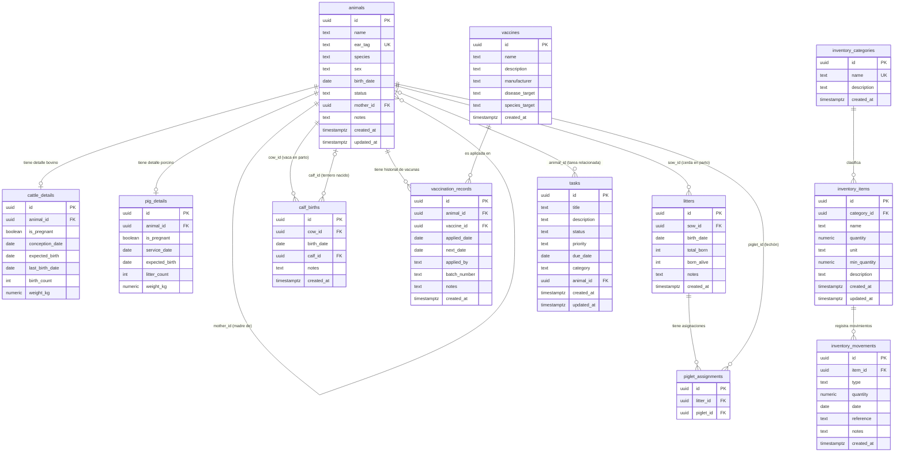

# Diagrama Entidad-Relación — Finca Agropecuaria

## Diagrama Mermaid



---

## Descripción de Relaciones

### Módulo de Animales

| Relación | Cardinalidad | Descripción |
|---|---|---|
| `animals` → `animals` (mother_id) | Muchos a uno (auto-ref.) | Un animal puede tener una madre registrada; una madre puede tener muchas crías. |
| `animals` → `cattle_details` | Uno a uno opcional | Solo animales con `species='cow'` tienen registro en `cattle_details`. |
| `animals` → `pig_details` | Uno a uno opcional | Solo animales con `species='pig'` tienen registro en `pig_details`. |
| `animals` → `calf_births` (cow_id) | Uno a muchos | Una vaca puede tener múltiples registros de parto. |
| `animals` → `calf_births` (calf_id) | Uno a uno opcional | Un ternero puede estar vinculado a exactamente un evento de parto. |
| `animals` → `litters` (sow_id) | Uno a muchos | Una cerda puede tener múltiples camadas registradas. |
| `litters` → `piglet_assignments` | Uno a muchos | Una camada puede tener múltiples lechones asignados. |
| `animals` → `piglet_assignments` (piglet_id) | Uno a uno | Un lechón pertenece a exactamente una camada. |

### Módulo de Vacunas

| Relación | Cardinalidad | Descripción |
|---|---|---|
| `animals` → `vaccination_records` | Uno a muchos | Un animal puede tener múltiples aplicaciones de vacunas. |
| `vaccines` → `vaccination_records` | Uno a muchos | Una vacuna puede ser aplicada múltiples veces a distintos animales. |

### Módulo de Inventario

| Relación | Cardinalidad | Descripción |
|---|---|---|
| `inventory_categories` → `inventory_items` | Uno a muchos | Una categoría agrupa múltiples ítems. |
| `inventory_items` → `inventory_movements` | Uno a muchos | Cada ítem tiene un historial completo de movimientos (entradas/salidas). |

### Módulo de Tareas

| Relación | Cardinalidad | Descripción |
|---|---|---|
| `animals` → `tasks` | Uno a muchos opcional | Una tarea puede estar vinculada a un animal específico, o ser general. |

---

## Diagrama Simplificado (visión de módulos)

```
┌─────────────────────────────────────────────────────────────┐
│                    MÓDULO ANIMALES                           │
│                                                             │
│   animals ──┬──► cattle_details  (1:1, solo vacas)          │
│    (base)   ├──► pig_details     (1:1, solo cerdos)         │
│             ├──► calf_births     (1:N partos bovinos)       │
│             ├──► litters         (1:N camadas porcinas)     │
│             │         └──► piglet_assignments (N:M crías)  │
│             └──► animals         (auto-ref. madre-cría)     │
└─────────────────────────────────────────────────────────────┘

┌─────────────────────────────────────────────────────────────┐
│                    MÓDULO VACUNAS                            │
│                                                             │
│   animals ──────► vaccination_records ◄──── vaccines        │
│                       (historial)          (catálogo)       │
└─────────────────────────────────────────────────────────────┘

┌─────────────────────────────────────────────────────────────┐
│                   MÓDULO INVENTARIO                          │
│                                                             │
│   inventory_categories ──► inventory_items                  │
│                                  └──► inventory_movements   │
└─────────────────────────────────────────────────────────────┘

┌─────────────────────────────────────────────────────────────┐
│                    MÓDULO TAREAS                             │
│                                                             │
│   tasks ────────────────────────► animals (opcional)        │
└─────────────────────────────────────────────────────────────┘
```
